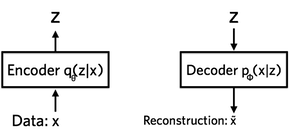
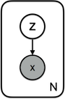
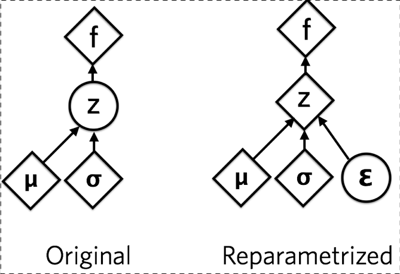
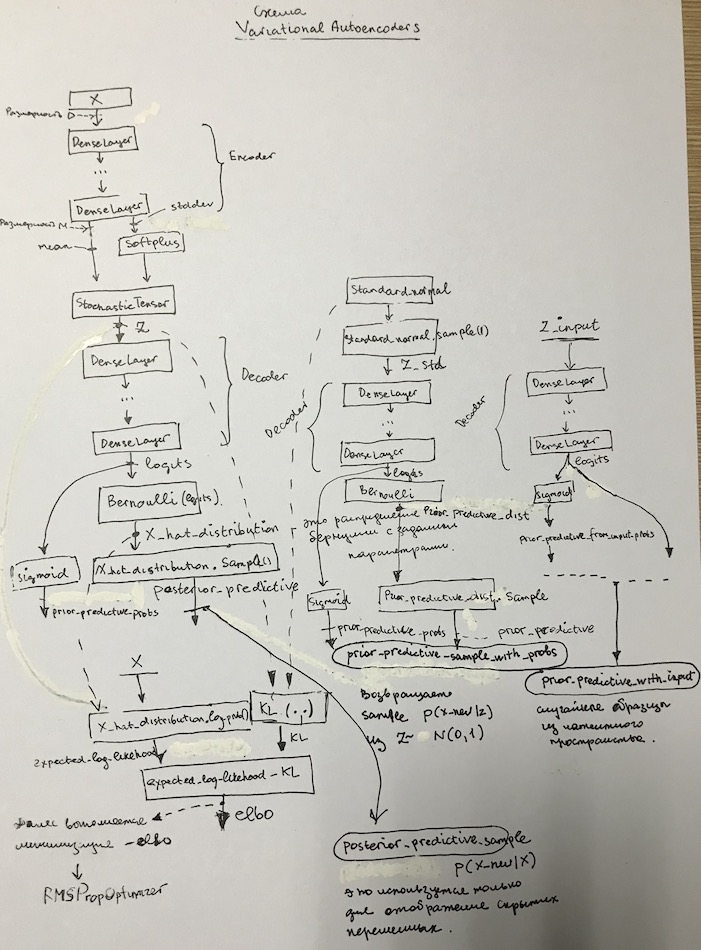

# Variational Autoecoder
* [1] https://jaan.io/what-is-variational-autoencoder-vae-tutorial/
* [2] https://github.com/blei-lab/edward/blob/master/examples/vae.py

# Tutorial - What is a variational autoencoder?
## Глоссарий
**Variational Autoencoder (VAE):** in neural net language, a VAE consists of an encoder, a decoder, and a loss function. In probability model terms, the variational autoencoder refers to approximate inference in a latent Gaussian model where the approximate posterior and model likelihood are parametrized by neural nets (the inference and generative networks).

**Loss function:** in neural net language, we think of loss functions. Training means minimizing these loss functions. But in variational inference, we maximize the ELBO (which is not a loss function). This leads to awkwardness like calling optimizer.minimize(-elbo) as optimizers in neural net frameworks only support minimization.

**Encoder:** in the neural net world, the encoder is a neural network that outputs a representation z of data x. In probability model terms, the inference network parametrizes the approximate posterior of the latent variables z. The inference network outputs parameters to the distribution q(z∣x).

**Decoder:** in deep learning, the decoder is a neural net that learns to reconstruct the data x given a representation z. In terms of probability models, the likelihood of the data x given latent variables z is parametrized by a generative network. The generative network outputs parameters to the likelihood distribution p(x∣z).

**Local latent variables:** these are the $z_i$ for each datapoint $x_i$. There are no global latent variables. Because there are only local latent variables, we can easily decompose the ELBO into terms $L_i$ that depend only on a single datapoint
$x_i$. This enables stochastic gradient descent.

**Inference:** in neural nets, inference usually means prediction of latent representations given new, never-before-seen datapoints. In probability models, inference refers to inferring the values of latent variables given observed data.

## Представление с точки зрения нейронных сетей
Variational autoencoders позволяют создать сложные генеративные модели данных и обучать их на больших данных.
VAE описаны:
1. https://arxiv.org/abs/1312.6114
2. https://arxiv.org/abs/1401.4082

Графическое представление:



**Кодер (Encoder) - это нейронная сеть.** Вход сети - это datapoint  x, выход сети - это скрытое представление z, сеть имеет веса и смещения θ. Например, x - 28 by 28-pixel photo of a handwritten number.
Encoder кодирует данные размерность которых
784 в латентное (скрытое) пространство представления z, которое имеет размерность значительно меньше чем 784 dimensions. Обычно на эту схему обозначают как ‘bottleneck’ (бутылочное горло или узкое горло), поскольку encoder должен обучиться эффективной компрессии данных в это пространство более низкой размерности. Обозначим Encoder как: $q_θ(z∣x)$. **Надо отметить**, что пространство низкой размерности - стохастическое: encoder преобразует параметры в $q_θ(z∣x)$, которая является Гауссовской плотностью вероятности. Мы можем генерировать пример из этого распределения, для получения зашумленных значений из представлений $z$.

```python
current_layer_value = self.X
for layer in self.encoder_layers:
    current_layer_value = layer.forward(current_layer_value)
self.means = current_layer_value[:, :M]
self.stddev = tf.nn.softplus(current_layer_value[:, M:]) + 1e-6
...
self.Z = st.StochasticTensor(Normal(loc=self.means, scale=self.stddev))
```

**Декодер (decoder) - это также нейронная сеть.** Входы данной сети -это представление $z$, выходы 0 это параметры распределения вероятностей данных. Сетьь также имеет веса и смещения $ϕ$
Декодер обозначается как:  $p_ϕ(x|z)$
Используя пример рукописных цифр, предположим, что изображения черно-белые и каждый пиксел представляется 0 или 1.
Распределение вероятностей каждого пикселя может быть предсталено как распределение Бернулли (Bernoulli). Декодер принимает на вход скрытое (латентное) представление цифры $z$ и Декодер и выходет 784 параметров Bernoulli, по одному для каждого из 784 пикселей на изображении.
Декодер "декодирует" вещественные числа в z 784 вещественных чисел [0..1].

Информация, конечно, теряется поскольку  она поступает из меньшей размерности в большую. **Сколько информации теряется?** Это вычисляется с использованием логарифмической вероятности восстановления (reconstruction log-likelihood) $log_{p_ϕ} (x∣z)$ whose units are nats. Эта мера  показывает насколько эффективно декодер обучен реконструировать входное изображение x по его скрытому представлению z.

Функция потерь variational autoencoder - это отрицательное log-likelihood с регуляризатором. Поскольку нет глобального представления, которое разделяют все точки данных, мы можем декомпозировать функцию потерь только в один член, который зависит от одной точки данных: $l_i$
Общая функция потерь для N точек данных будет равна: $\sum\nolimits_{i=1}^n l_i$. При этом функция потерь $l_i$ для точки данных $x_i$:

$l_i(\theta,\phi) = - E_{z \backsim q_\theta(z|x_i)}[log p_\phi(x_i|z)] + KL(q_\theta(z|x_i)||p(z))$

**Первый член** - это потери восстановления или ожидаемая негативная log-likelihood точки данных $x_i$. Ожидания берутся в отношении распределения кодера по представлениям. Этот член заставляет декодер учиться восстанавливать данные. Если выходы декодера не восстанавливают данные достаточно хорошо, этот член внесет большое значение стоимости в функцию стоимости.
```python
expected_log_likelihood = tf.reduce_sum(self.X_hat_distribution.log_prob(self.X),1)
```
где self.X_hat_distribution считается путем прогона z по слоям декодера:
```python
current_layer_value = self.Z
 for layer in self.decoder_layers:
     current_layer_value = layer.forward(current_layer_value)
 logits = current_layer_value
 self.X_hat_distribution = Bernoulli(logits=logits)
```
**Второй член**  - является регуляризатором, который мы вбрасываем (мы увидим, как он будет получен позже). Это дивергенция Кульбака-Лейбера (Kullback-Leibler divergence) между распределением кодера $q_\theta(z|x_i)$ и распределением $p(z)$. Эта дивергенция показывает как много информации теряется (in units of nats) когда q используется для того, чтобы представить p. Фактически это мера того, насколько q близко к p.

```python
kl = tf.reduce_sum(tf.contrib.distributions.kl_divergence(self.Z.distribution, standard_normal),1)
```
В variational autoencoder, p задается как стандартное нормальное распределение (standard Normal distribution) со средним равным 0 и дисперсией равной 1: $p(z)=Normal(0,1)$.
Таким образом если кодер выдает представления отличающиеся от представлений выдаваемых стандартным нормальным распределением - он получает штаф в функции потерь. Этот регуляризационный член означает ‘keep the representations z of each digit sufficiently diverse’. Если мы не включаем этот регуляризатор, то кодер мог бы научиться обманывать и давать каждую точку данных представления в отдельном регионе евклидова пространства. Это плохо, поскольку приводи к тому что два изображения одной цифры (например, написанные разными людьми) могли бы давать значительно отличающиеся представления. Мы хотим, чтобы пространство представления z было значимым, поэтому мы наказываем это поведение.  Это дает тот эффект, что представления похожих цифр будут близки друг к другу  (т.е. например, представление цифры 2 написанной несколькими разными людьми будут близки).

**Обучение:** VAE обучается методом градиентного споска для оптимизации функции потерь по в отношении параметров кодера θ и декодера ϕ.
Для сотастического градиентного спуска с шагом ρ, параметры кодера обновляются с использованием следующего уравнения:
$$
\theta \leftarrow \theta-\rho*\frac{∂l}{∂θ}
$$
Параметры декодера обновляются аналогично.

## Представление с точки зрения вероятностных моделей
Теперь рассмотрим  variational autoencoders с точки зрения вероятностнх моделей.  Рассмотрим концепцию VAE в изоляции от нейронных сетей и вернемся к нейронным сетям позднее.

В рамках вероятностных моделей variational autoencoder включают определенную вероятностную модель данных x и латентных переменных z. Запишем совместную вероятность модели как $p(x,z)=p(x∣z)p(z)$.
Генеративный процесс может быть описан следующим образом:
Для каждой точки данных i:
1. Получить скрытые переменные: $z_i ∼ p(z)$
2. Получить точку данных: $x_i ∼ p(x∣z)$

Это можно представить следующей графической моделью:



Это центральный объект, который надо рассматривать в VAE с точки зрения вероятностной модели. Латентные переменные вычисляются из приора p(z).
Данные x имеют вероятность $p(x|z)$, которая обусловлена скрытыми переменными
z. Модель определяет совместное распределение вероятностей $p(x,z)$ над данными и латентными переменными.

**Мы можем разложить** его в подобие и приор:
$p(x,z)=p(x∣z)p(z)$. Для черно-белых цифр подобие - это распределение Бернулли (Bernoulli).
Теперь мы можем думать о **выводе** в этой модели. Цель состоит в том, чтобы сделать вывод о хороших значениях скрытых переменных в представленных наблюдаемых данных, т.е. рассчитать постериор p(z∣x). Согласно Байесу:
$$
p(z|x) = \frac{p(x|z)*p(z)}{p(x)}
$$
тут:
* p(x) - evidence (убежденность)
* $p(z)$ - приор
* $p(x|z)$ - вероятность данных, в зависимости от скрытых переменных z

### Постериор p(x)
Рассмотрим деноминатор p(x) - он называется evidence (убежденность), и мы можем его вычислить путем игнорирования (маргинализации) скрытых переменных $p(x)= \int{p(x∣z)p(z)dz}$. **К сожалению,** этот интеграл требует экспоненциального времени для расчета, поскольку его необходимо рассчитать на всех конфигурациях скрытых переменных. **Поэтому мы будем аппроксимировать** это постериорное распределение.
Variational inference приближает постериор с использованием семейства распределений $q_\lambda(z∣x)$. Вариационный параметр $\lambda$ индексирует семейство распределений. Например, если q - Gaussian, $\lambda$ - будет средним и дисперсией скрытых переменных для каждой точки данных т.е.$\lambda_{x_i} = (\mu_{x_i}, \sigma^2_{x_i})$

**Как мы можем вычислить** - насколько хорошо вариационный постериор $q(z∣x)$ аппроксимирует действительный постериор $p(z∣x)$.
Для этого можно использовать дивергенцию Кульбака-Лейбера (Kullback-Leibler divergence), которая показывает количество информации потерянное при использовании q для аппроксимации p (in units of nats):
$$
KL(q_\lambda(z|x)||p(z|x)) = \mathbf{E}_q[log\space q_\lambda(z|x)] - \mathbf{E}_q[log\space p(x,z)] + log\space p(x)
$$

Таким образом - наша цель - найти варианционные параметры $\lambda$, которые минимизируют эту дивергенцию. Оптимальный приближенный постериор:
$$
q_\lambda*(z|x) = arg \space min_\lambda \space KL(q_\lambda(z|x)||p(z|x))
$$

**Почему невозможно вычислить это напрямую?** В дивергенции присутствует все та-же надоедливая убежденность  p(x). Ее невозможно эффективно вычислить, как обсуждалось выше. Нам нужен еще один ингредиент для разумного вариационного вывода.  Рассмотрим следующую функцию:
$$
ELBO(\lambda) =  \mathbf{E}_q[log\space p(x,z)] - \mathbf{E}_q[log\space q_\lambda(z|x)]
$$
Тогда мы можем переписать p(x) следующим образом:
$$
p(x) = ELBO(\lambda) + KL(q_\lambda(z|x)||p(z|x))
$$

В соответствии с неравенством Jensen’s дивергенция Кульбака-ЛЕйбера всегда больше или равна нулю. Это означает, что минимизация дивергенции Кульбака-Лейбера эквивалентна максимизации ELBO. ELBO - Evidence Lower BOund. ELBO позволяет аппроксимировать постериорное влияние и таким образом мы избежали вычисления и минимизации дивергенции Кльбака-Лейбера между приближенными и точными постериорами. Вместо этого мы можем *максимизировать* ELBO, что фактически эквивалентно, и вычислительно легко.

В модели variational autoencoder, существуют только **локальные скрытые переменные** z - т.е. нет точек данных, которые разделяют свое латентное значение z с латентными переменными другой точки данных. Таким образом мы можем разложить $ELBO$ на сумму, в которой каждый член зависит от одной точки данных. Это позволяет использовать для оптимизации стохастический градиентный спуск в отношении параметров $\lambda$. **Важно:** варианционные параметры разделяются между точками данных [тут](#Mean-field versus-amortized-inference).

**ELBO для одной точки данных в модели VAE:**
$$
ELBO_i(\lambda) =  \mathbf{E}_{q_\lambda(z|x_i)}[log\space p(x_i|z)] - KL(q_\lambda(z|x_i)||p(z))
$$
Эта формула получается из предыдущего определения ELBO:
1) Разложить log joint в члены приор и правдоподобие
2) Использовать правило умножения логарифма

## Соединение вероятностных моделей и неройнных сетей
1) Это параметризация приближенного постериора $q_\theta(z|x,\lambda)$ кодером (сетью вывода, inference network), который принимает на вход x и выдает параметры $\lambda$.
2) Далее мы параметризуем подобие $p(x∣z)$ декодером (генеративной сеть, generative network), которая принимает на вход скрытые переменные $z$ и выдает параметры распределения данных $p_\phi(x|z)$.
Соответственно, сеть вывода имеет параметры $\theta$, а генеративная сеть имеет параметры $\phi$.

Обычно параметры - веса и смещения нейронной сети. Мы оптимизируем их так, чтобы максимизировать ELBO с использованием стохастического градиентного спуска (SGD). Использовать SGD можено поскольку в модели нет глобальных скрытых переменных, поэтому можно использовать minibatch. Мы можем переписать ELBO и включить параметры сети вывода и генеративной сети:
$$
ELBO_i(\theta, \phi) =  \mathbf{E}_{q_\theta(z|x_i)}[log\space p_\phi(x_i|z)] - KL(q_\theta(z|x_i)||p(z))
$$
> Тут получается как в предыдущей формуле ELBO, но $\lambda$ заменяем на $\theta$, а $p(x_i|z)$ параметризируется c с использованием $\phi$ -> $p_\phi(x_i|z)$

This evidence lower bound is the negative of the loss function for variational autoencoders we discussed from the neural net perspective - $ELBO_i(\theta, \phi) = - l_i(\theta, \phi)$

Однако мы пришли к этому из принципиальных рассуждений о вероятностных моделях и аппроксимированном выводе постериора. Мы все еще можем интерпретировать член дивергенции Куллбака-Лейблера как регуляризатор, а член ожидаемого правдоподобия - как «ошибки» или потери при реконструкции.

Но вероятностная модель делает более ясным почему эти члены вообще существуют: для минимизации дивергенции Кульбака-Лейбера между приближенным постериором $q_\lambda(z|x)$ и действительным постериором модели $p(z∣x)$.

Что насчет параметров модели? Мы замалчиваем это, но это важный момент.
1) Термин ‘variational inference’ обычно относится к максимизации ELBO в отношении варианционных параметров $\lambda$.
2) Мы также можем максимизировать ELBO в отношении параметров модели $\phi$ (например, веса и смещения генеративной сети (декодера) параметризируют правдоподобие). Эта техника называется **variational EM** (expectation maximization), поскольку она максимизирует ожидаемое лог-правдоподобие данных в отношении параметров модели $\lambda$.

Таким образом variational inference получается так:
1) Мы определили вероятностную модель p скрытых переменных и данных
2) Вариационное семейство  q для скрытых переменных для аппроксимации постериора
3) Используем алгоритм варианционного вывода для обучения вариационных параметров (gradient ascent on the ELBO to learn $\lambda$).
4) Используем variational EM для параметров модели (gradient ascent on the ELBO to learn $\phi$).

## Репараметризация
Последнее, что необходимо понимать перед реализацией VAE - это то, как получить производные по параметрам стохастических переменных. Пусть мы имеем  $z$, которое получено из распределения $q_\theta(z|x)$, и мы хотим получить производны функции $z$ по параметрами $\theta$, то как мы можем это сделать? Хотя образец z  - фиксиронный, интуитивно понятно, что производные не должны быть равны нулю.

Для некотороых распределений возможно репараметризовать функцию получени] образца таким путем, что стохастическая составляющая не будет зависеть от параметров. Поскольку мы хотим, чтобы наши образцы детерминистически зависели от параметров распределения. Например, для нормально распределенных величин со средним (мат. ожиданием) $\mu$ и стандартным отклонением $\sigma$, мы можем сгенерировать образец следующим образом:
$$
z = \mu + \sigma \odot \epsilon
$$
где, $\epsilon \sim Normal(0,1)$. $\sim$ - означает генерацию образца из заданного распределения.  Переход от $\sim$, к знаку равенства $=$ - это решающий шаг.  Мы определяем функцию, которая зависит от переметров детерминистки. Таким образом мы можем получить производные функции $f(z)$, которая включает z, от параметров его распределения $\mu$ и $\sigma$.



**Репараметризация позволяем нам вынести случайность нормально распределенной случайной величины в $\epsilon$, которая генерируется из стандартного нормального распределения.**
Ромбы - означают детерминистические зависимости, круги - случайные переменные.

В VAE  среднее и дисперсия - являются выходами сети вывода (inference network) с параметрами $\theta$, которые нам необходимо оптимизировать. Таким образом, репараметризация позволяет нам делать обратное распространение (брать производные с использованием правила цепочки) в отношении $\theta$ по целемому значению ($ELBO$), которая является функцией от образцов из латентных переменных z.

## Workflow

Оптимизируются веса и смещения слоев DenseLayer:
```python
class DenseLayer(object):
    def __init__(self, M1, M2, f=tf.nn.relu):
        self.W = tf.Variable(tf.random_normal(shape=(M1, M2)) * 2 / np.sqrt(M1))
        self.b = tf.Variable(np.zeros(M2).astype(np.float32))
```



**TensorFlow делает пепараметризацию автоматически**

* self.prior_predictive - Prior Predictive
* self.prior_predictive_probs - Вероятности Prior Predictive
* self.prior_predictive_from_input_probs - Вероятности Prior Predictive от ходов - только для визуализации
